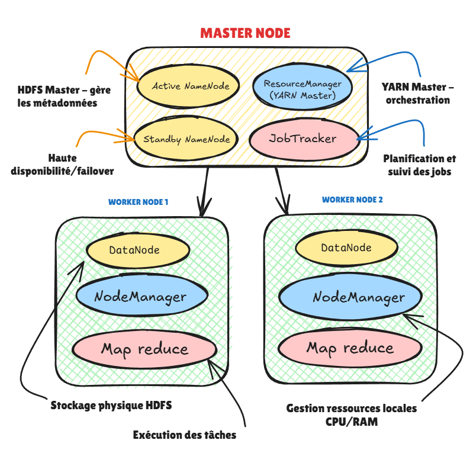
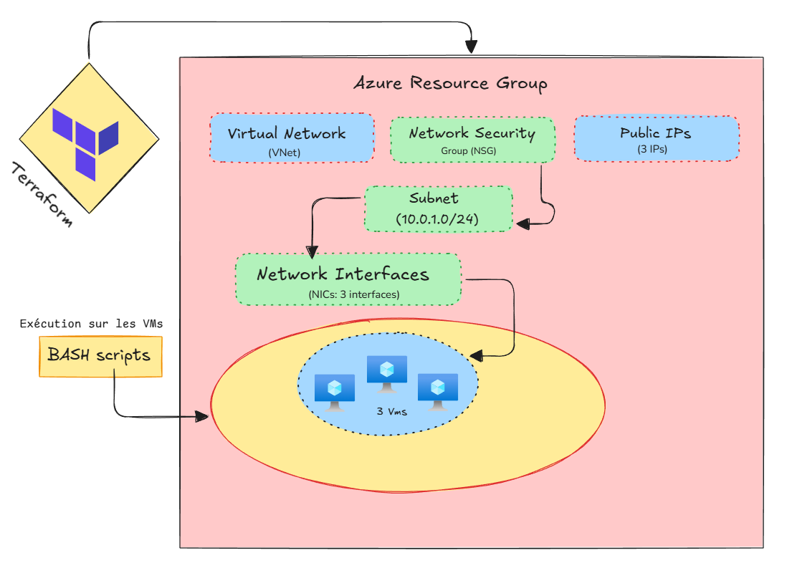
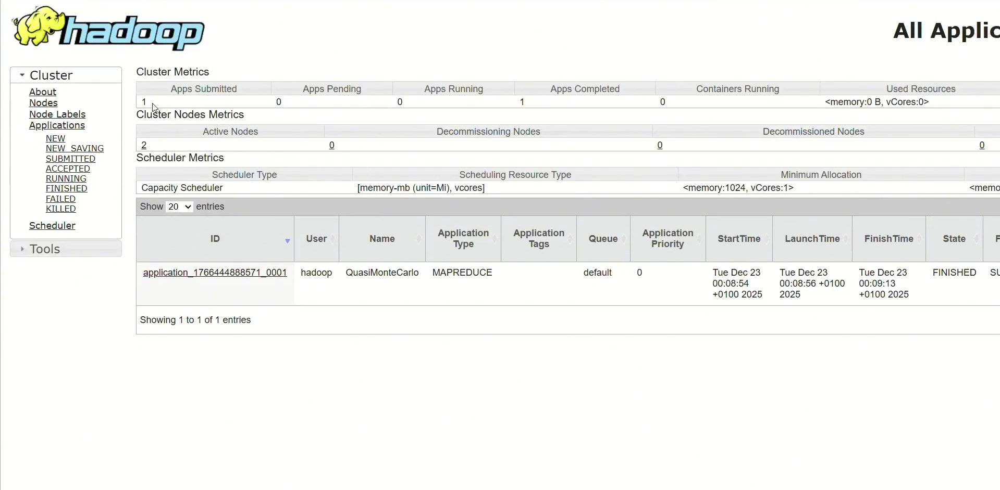
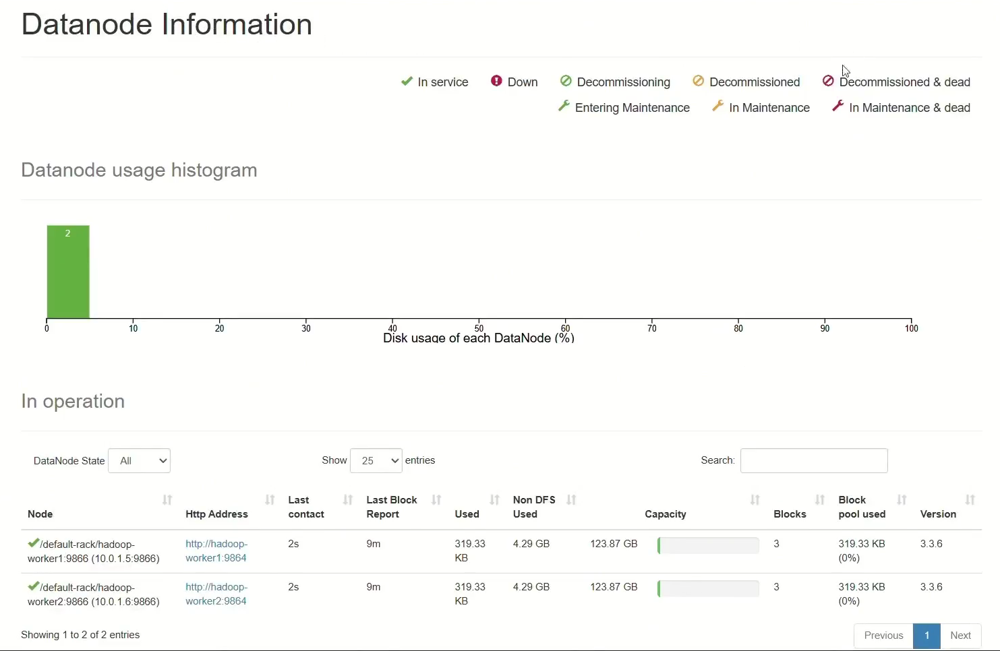
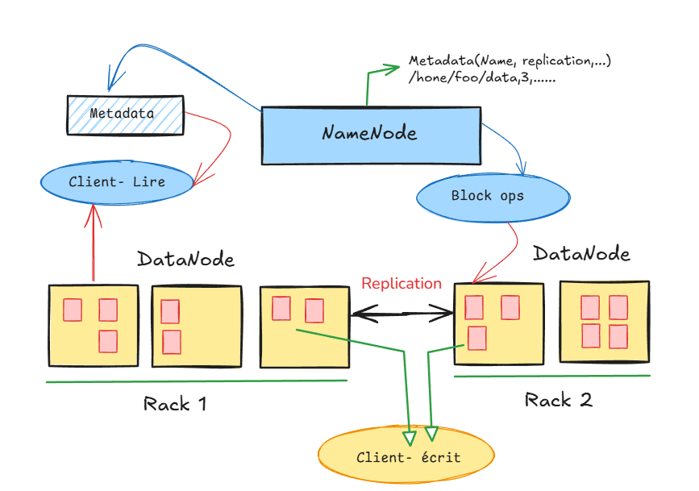
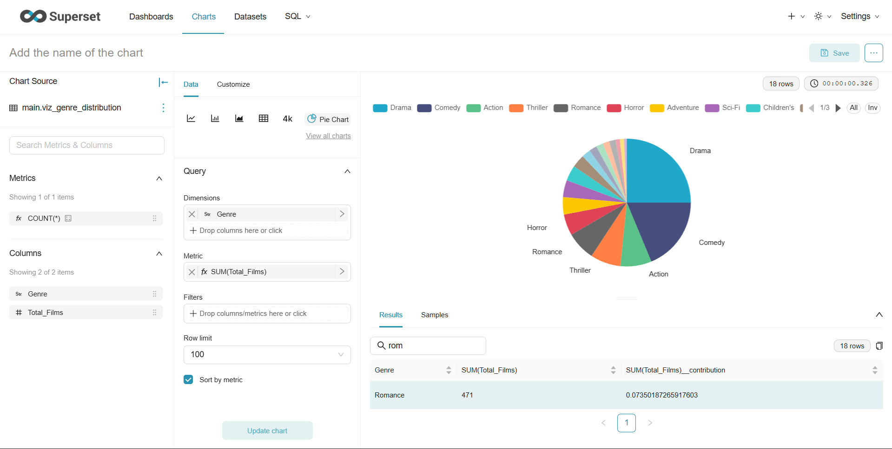
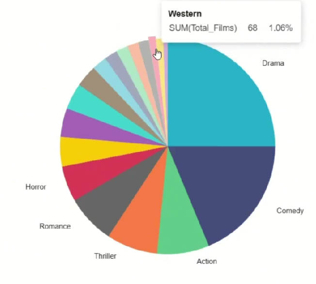
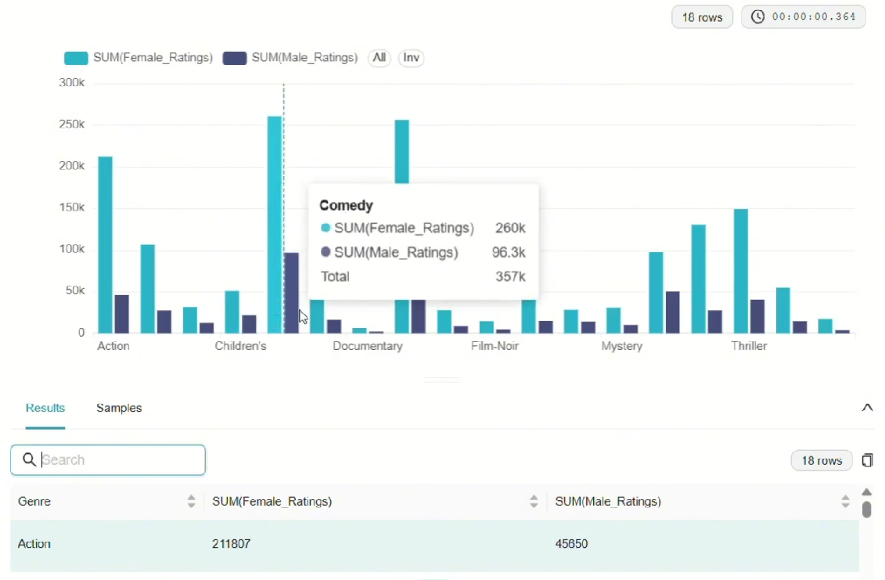
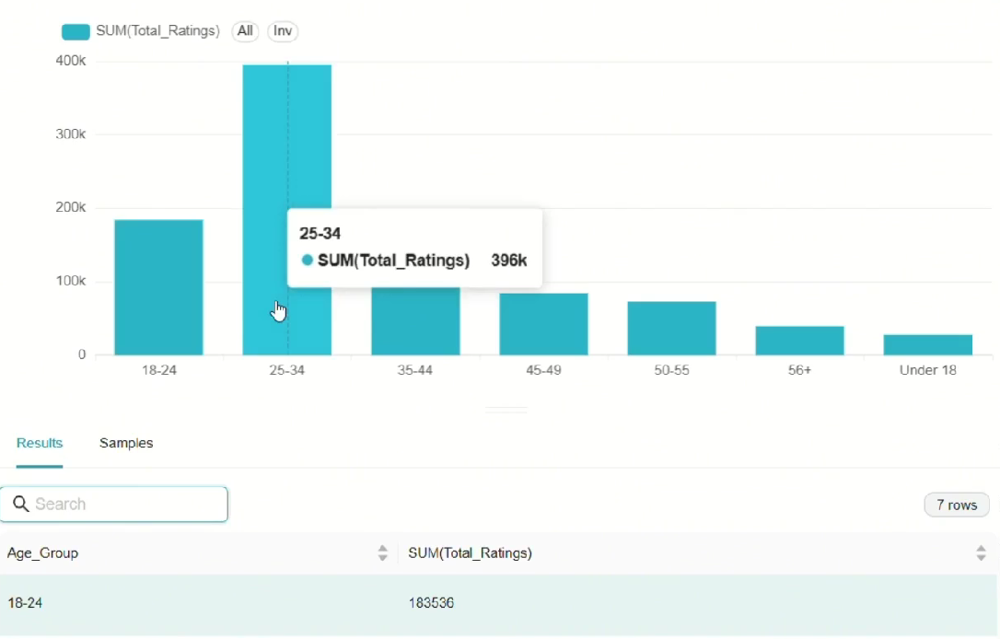

# **MovieLens — Cluster Hadoop distribué / Hive + Analyse**

**Projet** : Déploiement et utilisation d'un cluster distribué Hadoop/Hive (sur Azure via Terraform) pour analyser le dataset MovieLens (ratings, movies, users) et exécuter des jobs MapReduce et des requêtes Hive.

## Accessibilité du projet

- **Vidéo de démonstration :** [Vidéo du projet](https://e.pcloud.link/publink/show?code=kZAQnNZvzWdFnVGhhRb4O0EnUyWtjw6SlfV)
- **Dépôt GitHub :** [Code source](https://github.com/Jeathu/MovieLens-Big-Data-project)
- **Rapport détaillé :** [Rapport détaillé](https://e.pcloud.link/publink/show?code=XZ9NwNZkcP4CMO70tSJPSJo6WgkwBU0Tak7)

<br>

> **Note :** Consultez les fichiers README dans les sous-dossiers `terraform/_terraforme_setup.md` et `src/MapReduce/_MapReduce_readme.md` pour des instructions détaillées.

## Conformité avec le Sujet



Le cluster se compose de 3 machines virtuelles exécutant **Ubuntu 20.04 LTS** :

|     Rôle     |    Nom d'hôte    | Composants                                |
| :----------: | :--------------: | :---------------------------------------- |
|  **Master**  | `hadoop-master`  | NameNode, ResourceManager, Metastore Hive |
| **Worker 1** | `hadoop-worker1` | DataNode, NodeManager                     |
| **Worker 2** | `hadoop-worker2` | DataNode, NodeManager                     |

<br>

### Architecture du cluster Hadoop déployé :



<br>

#### - Visualisation Hadoop YARN ResourceManager UI - Master Node:




<br>

#### - Datanode fonctionnement :



<br>

---

## Contenu du dépôt du projet

- `data/` -> Guide et description du dataset MovieLens
- `src/Hive/` — Scripts HQL : création de tables, partitions/buckets, analyses et système de recommandation
  - `01_Tables.hql`, `02_Partitions_Buckets.hql`, `03_Analyses.hql`, `04_Sys_Recommandation.hql`
- `src/MapReduce/` — Scripts Python pour Hadoop Streaming (mappers/reducers)
  - `avg_rating_mapper.py`, `avg_rating_reducer.py`, `genre_count_mapper.py`, `genre_count_reducer.py`, `user_activity_mapper.py`, `user_activity_reducer.py`
- `terraform/` — Infrastructure as Code pour provisionner un cluster Azure (VMs, réseau, NSG, provisioners) + scripts d'installation
  - `main.tf`, `variables.tf`, `terraform.tfvars`, `scripts/bootstrap_master.sh`, `scripts/bootstrap_worker.sh`, `scripts/complete_setup.sh`, `scripts/diagnose_cluster.sh`

<br>
<br>

---

## Arborescence du projet

Voici l'arborescence actuelle du dépôt :

```C

├── data/
│
├── src/
│   ├── Hive/
│   │   ├── 01_Tables.hql
│   │   ├── 02_Partitions_Buckets.hql
│   │   ├── 03_Analyses.hql
│   │   └── 04_Sys_Recommandation.hql
│   └── MapReduce/
│       ├── _MapReduce_readme.md
│       ├── avg_rating_mapper.py
│       ├── avg_rating_reducer.py
│       ├── genre_count_mapper.py
│       ├── genre_count_reducer.py
│       ├── user_activity_mapper.py
│       └── user_activity_reducer.py
├── terraform/
│   ├── _terraforme_setup.md
│   ├── clean_local.sh
│   ├── fix_cluster.sh
│   ├── hadoop_ssh_key.pub
│   ├── main.tf
│   ├── outputs.tf
│   ├── plan.tfplan
│   ├── terraform.tfstate
│   ├── terraform.tfstate.backup
│   ├── terraform.tfvars
│   ├── variables.tf
│   └── scripts/
│       ├── bootstrap_master.sh
│       ├── bootstrap_worker.sh
│       ├── complete_setup.sh
│       └── diagnose_cluster.sh
```

<br>
<br>

---

## Objectifs du projet

- Fournir un environnement Hadoop distribué prêt à l'emploi (Master + 2 Workers).
- Démontrer des analyses data via Hive (agrégations, partitions, buckets, ORC).
- Exécuter des jobs MapReduce (Hadoop Streaming) pour des analyses complémentaires.

<br>
<br>

---

## Prérequis

- **Terraform** >= 1.0
- **Azure CLI** (authentification via `az login`)
- **Terminal Unix** (Linux/macOS ou WSL sous Windows)
- **Python 3** (pour l'exécution des scripts MapReduce)

<br>
<br>

---

## Déploiement rapide (Azure + Terraform)

### Étapes de déploiement

1. **Initialisation du projet** - Se placer dans le répertoire `terraform/` :

```bash
cd terraform
terraform init
terraform apply -auto-approve
```

2. **Récupération des informations** - À la fin, Terraform génère une clé (`hadoop_ssh_key.pem`) et affiche les adresses IP publiques.

3. **Configuration des permissions** - Copier la clé et corriger ses permissions :

```bash
chmod 600 hadoop_ssh_key.pem
```

4. **Finalisation du cluster** - Mettre à jour `fix_cluster.sh` avec les IPs publiques (si nécessaire) et exécuter :

```bash
bash fix_cluster.sh
```

> Le script `bootstrap_master.sh` et `bootstrap_worker.sh` sont uploadés et exécutés automatiquement via des provisioners Terraform. Ils installent Java 8, Hadoop et Hive et configurent SSH sans mot de passe pour l'utilisateur `hadoop`.

<br>
<br>

---

## Accès au cluster

- SSH sur le master :

```bash
ssh -i ~/hadoop_ssh_key.pem hadoopadmin@<MASTER_PUBLIC_IP>
```

- Vérifications utiles (sur le master) :

```bash
sudo -u hadoop /opt/hadoop/bin/hdfs dfsadmin -report
sudo -u hadoop /opt/hadoop/bin/yarn node -list

# Lancer un exemple MapReduce (pi) pour vérifier YARN
sudo -u hadoop /opt/hadoop/bin/yarn jar /opt/hadoop/share/hadoop/mapreduce/hadoop-mapreduce-examples-*.jar pi 2 100
```

<br>
<br>

---

## Chargement & organisation des données

- Placez les fichiers MovieLens (ex: `ratings.dat`, `movies.dat`, `users.dat`) dans HDFS sous les chemins attendus par les scripts Hive :

```bash
sudo -u hadoop hdfs dfs -mkdir -p /user/movielens/ratings
sudo -u hadoop hdfs dfs -put ratings.dat /user/movielens/ratings/
# même pour movies, users
```

- `src/Hive/01_Tables.hql` contient la création des tables externes en utilisant `RegexSerDe` pour parser le format `::`.

> Licence: Le dataset MovieLens est soumis à des conditions d'usage (voir `data/data_guide.md`). Pour publications, **citez** :
> F. M. Harper and J. A. Konstan. (2015) The MovieLens Datasets: History and Context. TiiS.

<br>
<br>

---

## Exemples d'utilisation

### 1) Jobs MapReduce (Hadoop Streaming) - Voir `src/MapReduce/_MapReduce_readme.md` pour plus de détails

- Moyenne des ratings par film :

```bash
hadoop jar $HADOOP_HOME/share/hadoop/tools/lib/hadoop-streaming-*.jar \
  -input /user/movielens/ratings/ratings.dat \
  -output /user/movielens/output/avg_ratings \
  -mapper "python3 avg_rating_mapper.py" \
  -reducer "python3 avg_rating_reducer.py" \
  -file avg_rating_mapper.py -file avg_rating_reducer.py
```

- Compter films par genre, ou activité utilisateurs — les exemples sont dans `src/MapReduce/_MapReduce_readme.md`.

> Supprimez l'output existant avant chaque exécution : `hdfs dfs -rm -r /user/movielens/output/<job>`

### 2) Requêtes Hive - Voir `src/Hive/` pour plus de détails

- Charger les tables : ouvrez `hive` puis exécutez `01_Tables.hql` pour créer les tables externes.
- Utilisez `02_Partitions_Buckets.hql` pour apprendre/implémenter le partitioning et le bucketing.
- Exécutez `03_Analyses.hql` pour des requêtes analytiques (top films, genres, activité utilisateur).
- `04_Sys_Recommandation.hql` contient des exemples de recommandations (collaborative & content-based simples).

<br>
<br>

---

## Tests et vérifications

- Vérifier HDFS : `hdfs dfs -ls /user/movielens`
- Vérifier Hive : `hive -f src/Hive/01_Tables.hql` puis `SHOW TABLES; SELECT COUNT(*) FROM ratings;`
- Logs bootstrap : `/home/hadoop/bootstrap.log` (sur chaque nœud)

<br>
<br>

---

## Démonstration avec Apache Superset

### Distribution des types de films






### Analyse comparative des préférences par genre



### Notation par tranche d'âge



<br>

---

## Licence

- Les données MovieLens sont soumises à la licence/citation décrite dans `data/data_guide.md`.

<br>
<br>

---

## Fichiers clés à consulter

- `terraform/_terraforme_setup.md` — guide déploiement & post-install
- `src/Hive/*` — scripts Hive pour ingestion & analyses
- `src/MapReduce/*` — jobs MapReduce et exemples d'exécution

---
